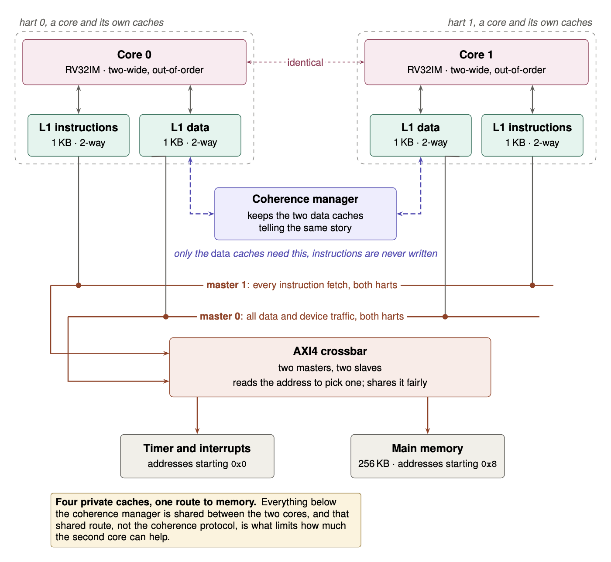
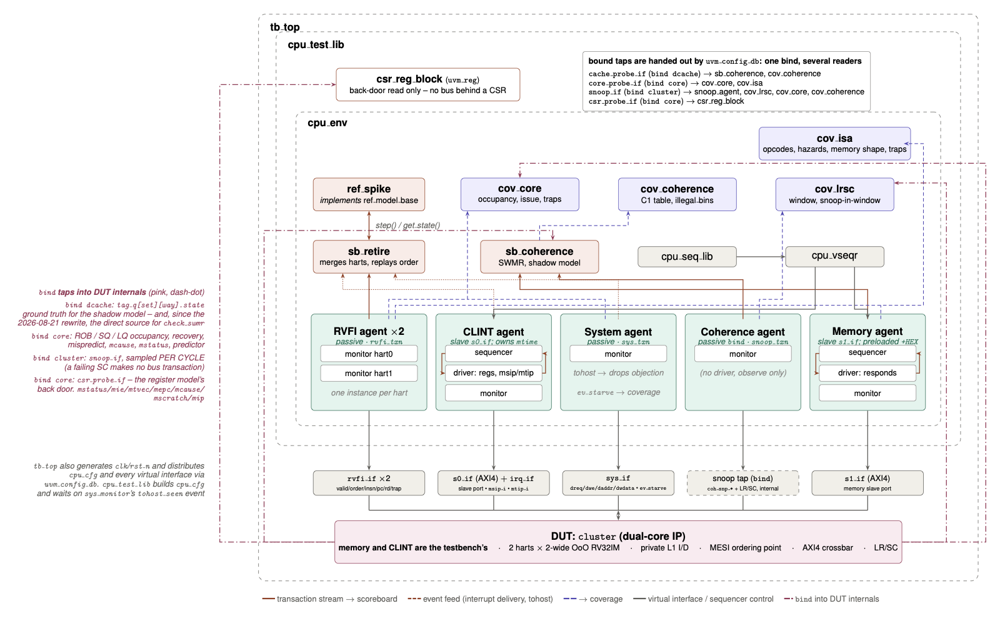

# A dual-core, two-wide out-of-order RISC-V processor, with a UVM verification environment

**RV32IM** · two harts, each 2-wide superscalar and out-of-order · speculative
execution · private L1 caches kept coherent with **MESI** over an **AXI4**
crossbar · **LR/SC** atomics and a CLINT · verified with **UVM** against Spike.

Written from nothing over seven stages: single-cycle, pipelined, hazard
resolution, caches, out-of-order, dual-core coherence, and then a verification
environment built to find out whether any of it was actually true. Still going;
see [what comes next](#status-and-what-comes-next).

[](docs/overview.pdf)

### Start here: [`docs/overview.pdf`](docs/overview.pdf)

An illustrated tour of the whole design, and the thing I would rather you read
than this file. Eleven chapters, each one taking a single problem, showing the
picture, and ending with a measurement rather than a claim: why one instruction
per clock is the slow way, what a branch predictor is actually guessing, why an
overflowing return stack should freeze rather than wrap, what it costs to make
two caches agree. The first half of every chapter assumes no background; the
second half is for engineers. Click the figure above to open it.

---

## What it is

| | |
|---|---|
| **ISA** | RV32IM with Zicsr, Zifencei and Zalrsc (LR/SC), machine mode only |
| **Cores** | 2 harts, 2-wide superscalar, out-of-order issue, in-order commit |
| **Renaming** | 32 architectural → 64 physical registers, 32-entry map table |
| **Out-of-order** | 32-entry ROB, 16-entry issue queue, 8-load/8-store LSQ, 4 branch checkpoints |
| **Prediction** | 64-entry BTB, gshare with 1024 two-bit counters and a 10-bit history, 8-entry RAS |
| **Execution** | registered execute stage, 2 ALUs, branch unit, 3-cycle multiplier, 35-cycle radix-2 divider |
| **Caches** | private 1 KB L1I and L1D, 2-way, 16-byte lines, write-back, write-allocate |
| **Coherence** | MESI by snooping, one central ordering point that serialises snoops and lets fills overlap |
| **Interconnect** | AXI4 crossbar, 2 masters × 2 slaves, no L2 |
| **Verification** | UVM: 5 agents, 2 scoreboards, Spike over RVFI, 4 coverage models, mutation testing |
| **RTL** | ~9,700 lines of SystemVerilog |

---

## Does it work?

Don't take a number from this file - ask the tree:

```bash
make check
```

`audit` runs first (nine file-level audits, seconds, no build) so an internally
inconsistent tree fails in seconds rather than fifty minutes in. Then the full
gate battery. On a tree that has never been run, use `make verify`, which builds
the simulator and produces the coverage authorities the audits read. Roughly
70 minutes from cold, 15 warm.

The figures below are **checked by a script**. `scripts/docs_audit.sh` diffs
every one against the artefact that owns it - `Makefile`'s `GATES`, the three
rosters in `docs/`, the coverage union - and battery gate `uvm_docs` fails if
any has drifted. They are not typed prose.

<!-- BEGIN CURRENT FIGURES -- checked by scripts/docs_audit.sh -->
```
gates       92
bins        763
hit         632
unhit       131
sites       161
design      42
mechanisms  27
proven      13
vacuous     32
av_proven   9
av_unproven 23
mut         23
mut_caught  18
mut_inert   4
mut_missed  1
```
<!-- END CURRENT FIGURES -->

**92 gates, 0 failures.** ~189,000 instructions compared against Spike with zero
mismatches (a recorded figure, not a gated one; see `docs/results.md`). **763 coverage bins**, 632 reached by a real program and **131
unhit - every one carrying a written proof of why it cannot be reached, checked
against the RTL it cites on every run, or an explicit statement that no program
forces it**. 23 deliberate mutations: 18 caught, 4
that changed nothing observable, 1 missed and recorded as missed.

And the number that matters most: of 26 design mechanisms, **13 have been shown
able to fail** (11 under the strict reading in `docs/verification.md`). The rest
are hypotheses, and they are listed as such.

---

## Repository structure

```
rtl/       the CPU              common/ ooo/ mem/
tb/        testbenches          uvm/ (the environment) units/ ooo/ axi4/
asm/       test programs        .S and .c sources, built .hex/.elf, compliance/ litmus/
scripts/   every harness        the Makefile is a front door; these are the authority
docs/      the tour, the claims, the lessons, and the machine-read rosters
```

One rule about that layout: **the harnesses in `scripts/` are the authority, not
the Makefile.** Each is independently runnable and anchors itself to the project
root, so it works from any working directory. The Makefile names the common
entry points and nothing more.

**`asm/*.hex` and `asm/*.elf` are committed on purpose.** Nothing in the flow
regenerates them, so every committed program runs without a RISC-V
cross-toolchain. The full battery still needs one: it compiles `ctest` and reads
ELF symbols with `nm`, and the container provides it. `scripts/check_asm_fresh.sh`
keeps the binaries honest against their sources by content hash.

---

## Where the results are

Four documents, and they are meant to be read in this order:

| you want | read |
|---|---|
| the illustrated tour of the design | **[`docs/overview.pdf`](docs/overview.pdf)** |
| every measurement, with the command that reproduces it | **[`docs/results.md`](docs/results.md)** |
| what the verification claims - and what it does **not** | **[`docs/verification.md`](docs/verification.md)** |
| the methodology worth stealing | **[`docs/defects_and_lessons.md`](docs/defects_and_lessons.md)** |

### And four files that are evidence, not reading

These exist so the battery has something to check against, and so a claim in
the four documents above can be followed to its source. They are generated or
hand-classified state, not prose - skim them only to verify something specific.

| file | what checks it |
|---|---|
| [`docs/coverage_proofs.md`](docs/coverage_proofs.md) | one written proof per unhit bin; `cite_audit.sh` follows all 35 RTL citations, `cov_proof_audit.sh` diffs the roster against the measured unhit set |
| [`docs/checker_roster.txt`](docs/checker_roster.txt) | every checker site with its class and the mutation that proved it; `checker_audit.sh` diffs it against the testbench source both ways |
| [`docs/gate_roster.txt`](docs/gate_roster.txt) | one line per gate; `run_regression.sh` diffs it against the gates that actually ran |
| [`docs/mutation_roster.txt`](docs/mutation_roster.txt) | one row per mutation; the authority for the caught / inert / missed tally |

---

## Building and running

Everything runs in a container. The image holds only the toolchain - Verilator
5.050 built from source, Spike, the RISC-V GCC cross-toolchain, the Accellera
UVM library and z3 - and the project is mounted at `/work`, so edits on the host
are live inside.

```bash
docker build -t rv32i-uvm .
```

`JOBS` defaults to 4. The binding constraint is RAM per `g++` process, not
cores: Verilator's own translation units peak near 1 GB each, so `-j8` against a
4-5 GB VM gets `cc1plus` OOM-killed twenty minutes in. On a 16 GB host use
`--build-arg JOBS=8`.

```bash
docker run -it --rm -v "$(pwd)":/work -v rv32i_ccache:/ccache rv32i-uvm
make help
```

**The second mount is not optional.** Verilator packs the whole UVM class
library into a few multi-megabyte C++ translation units, and `g++` takes minutes
on each. Measured: a no-change rebuild is **27 minutes without the ccache
volume and 23 seconds with it.** Without a named volume the cache dies with the
container and that cost is paid on every run.

### The two external repositories the battery needs

`gates/clone_refs.sh` clones two repositories into `/opt/refs` at image-build
time, pinned to full 40-character commit SHAs. Both are load-bearing at run
time, not reading material:

- **riscv-dv** - gate `ctest_rvfi_ooo` imports `spike_log_to_trace_csv.py` and
  `instr_trace_compare.py` from it
- **litmus-tests-riscv** - `run_litmus.sh` reads its `model-results/herd.logs`
  as the oracle for the memory-model tests, and exits without it

`clone_refs.sh` checks that both of those files actually arrived, and warns
loudly if a pin has drifted. It always exits 0, so a moved upstream repository
yields a degraded image whose litmus gate fails later with a missing oracle
rather than failing the build.

---

## What this project is actually about

Hunting for bugs in the CPU turned up almost none. What it turned up instead,
about twenty, were bugs in the **instruments**: the checkers, the audits, the
rosters, and the gate wiring that decides whether a checker firing can fail the
battery at all. Later, a close read of the design did find real CPU bugs, in
exactly the places those instruments were blind; section 9 of
`docs/defects_and_lessons.md` records them.

That ratio is the whole story, and it is why the documentation is shaped the way
it is. A green suite that cannot fail is worth nothing, so most of the effort
here went into proving the suite *can* fail: breaking the design on purpose and
requiring each checker to go red, then checking that the thing reading the logs
could see it, then checking that the gate could see *that*.

[](docs/overview.pdf)

The environment that produces those numbers: five agents on the dual-core
cluster, two scoreboards kept deliberately separate, Spike as a reference model
over the retirement stream, four coverage models, and a register model reading
the CSRs through a back door because no bus reaches them.

Some of what that turned up:

- A gate allowlist that two files agreed on perfectly while both were
  incomplete - **fourteen design mechanisms could fire while the battery still
  passed.** Under one mutation, three gates logged `SWMR violated` and *passed*.
- A reference model that had stopped stepping and was reported as keeping up.
  Against a DUT alternating `wfi`/`j`, a frozen Spike **matches half the time** -
  and matches get counted while errors get investigated.
- A checker credited with a mutation proof whose own words appear in **zero log
  files anywhere on the machine.** An attribution nobody checks against a log is
  indistinguishable from a proof until somebody checks.
- Two checkers that fire **404 times on a correct design and 404 times on a
  broken one** - identical output either way, and previously counted as proven.
- A guard whose `grep` asked for a literal `.` where the record carries `\001`,
  so it matched zero records in any coverage file the project has ever produced.

Every one is written up in **[`docs/defects_and_lessons.md`](docs/defects_and_lessons.md)**,
by *shape* rather than as a list of incidents, because the shapes recur and the
incidents don't.

If you take one idea away, take that one: it is easy to build something that
works, and much harder - and much more valuable - to build the thing that would
tell you if it had stopped working, and then to check that *that* thing works
too.

---

## What is not claimed

**[`docs/verification.md`](docs/verification.md)** is the closing position. It
states what the verification claims, and then lists everything it does **not**
claim with each reason graded **strong / adequate / weak / none**.

Exactly one item carries `none`, and it is named rather than buried: **a cache
dropping a modified line without writing it back has no independent check.**

Also out of scope by decision, and each would be mandatory for a commercial
sign-off: formal verification, an SVA layer, an AXI VIP, more than two harts,
and 100% code coverage; 319 of 2,082 line and branch points never execute.

---

## Status and what comes next

This is ongoing work. What is here is finished enough that the numbers are real
and reproducible, and it is not where the project stops.

**FPGA verification.** Everything so far is simulation. Putting the design on a
board is the next test and the one simulation cannot stand in for: synthesis
rather than elaboration, timing closure at a real clock, real memory with real
latency, and whatever the tools reject that Verilator was happy to accept. A
design that has never been synthesised has not been told no by anything.

**Neural network inference, and the instructions to make it fast.** After that,
a real workload rather than a benchmark chosen to exercise a structure. The
inner loop of a neural network is a matrix multiply, and on a scalar RV32IM
machine it is close to the worst case this design has: a 1 KB L1D against
working sets that do not come close to fitting, one multiply per issue slot,
and a loop whose branches the predictor gets right while the memory system
falls behind regardless. That combination is useful precisely because nothing
about it was chosen to flatter the machine.

The order is measure, then change. First the software side, so the hardware is
answering a real question: block the kernel to the cache that actually exists,
and separate the misses that belong to the loop from the misses that belong to
the cache. Then extensions in the RISC-V custom opcode space, each aimed at a
cost the measurement has already shown:

- a widening multiply-accumulate over packed 8-bit operands - four products
  summed into one 32-bit accumulator per instruction - which is where
  quantised inference spends most of its time, and which the existing 33-bit
  multiplier can be widened toward rather than replaced;
- a strided load, so walking a column costs one instruction instead of an
  address computation per element, and so the LSQ sees one entry where it
  currently sees eight;
- a MAC array as a functional unit hanging off the issue queue, so the
  out-of-order machinery that is already built is what keeps it fed, rather
  than a separate accelerator bolted on beside the core.

Each of those is a claim that has to be paid for. More work per instruction
only helps if the memory system can supply it, a deeper accumulator is a longer
pipeline to flush on a mispredict, and an added functional unit competes for
issue bandwidth that two ALUs already want. So the result to report is not that
it got faster - it will - but speedup per added gate, measured against the
scalar loop on the same core, with the cases where the extension loses stated
alongside the cases where it wins.

The design's own deferred items are separate from those and already written
down: chapter 10 of [`docs/overview.pdf`](docs/overview.pdf) lists them with the
measurement that justifies each, and
[`docs/verification.md`](docs/verification.md) states what the verification does
not yet claim.

---

## License

Apache License 2.0; see `LICENSE`. Third-party material and the upstream
riscv-tests licence are recorded in `NOTICE`.

